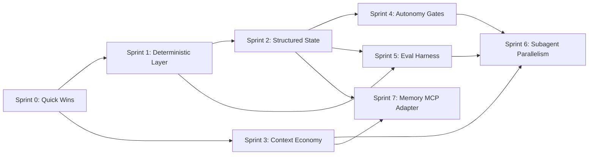

# kyro-modernization — Adaptive Roadmap

> Generated by `kyro-workflow` on 2026-06-11

---

## Project Paths

| Path | Value |
|------|-------|
| Codebase | `/Users/rperaza/joicodev/synapsync/kyro/kyro-workflow` |
| Working Directory | `/Users/rperaza/joicodev/synapsync/kyro/kyro-workflow/.agents/sprint-forge/kyro-modernization` |
| Findings | `/Users/rperaza/joicodev/synapsync/kyro/kyro-workflow/.agents/sprint-forge/kyro-modernization/findings/` |
| Sprints | `/Users/rperaza/joicodev/synapsync/kyro/kyro-workflow/.agents/sprint-forge/kyro-modernization/sprints/` |

---

## Thesis

Kyro's current strength is its disciplined sprint lifecycle. The modernization keeps that essence while moving fragile prompt-only rules into deterministic code, structured state, measured evals, and optional parallel execution.

---

## Execution Rules

1. **Sprint-by-Sprint** — Sprints are generated one at a time. Never pre-generate future sprint documents.
2. **Retro Feeds Forward** — Sprint N+1 must consume Sprint N's retro, recommendations, and debt table.
3. **Recommendations are Dispositioned** — Every previous recommendation must be incorporated, deferred, resolved, rejected with reason, or converted into a phase.
4. **Debt is Inherited** — Accumulated debt is never deleted. Items only transition status.
5. **Phases are Suggested** — Roadmap phases are starting points. Emergent findings may create new phases.
6. **Re-entry Prompts are Updated** — Refresh re-entry prompts after INIT and every sprint close.
7. **Roadmap Adapts** — Later sprints remain subject to earlier retros.
8. **Definition of Done** — Each sprint has explicit exit criteria and cannot close without them.

---

## Dependency Map

---

## Sprint Summary

| Sprint | Finding Source | Version | Type | Focus | Dependencies | SP | Status |
|--------|---------------|---------|------|-------|--------------|----|--------|
| 0 | `findings/quick-wins.md` | 3.3.1 | debt | Fix 5 confirmed issues and restore baseline integrity | — | 11 | completed |
| 1 | `findings/deterministic-layer.md` | 3.4.0 | feature | Replace prompt-only checkpoints with scripts and hooks | 0 | 24 | completed |
| 2 | `findings/structured-state.md` | 3.5.0 | refactor | Make `state.json` the source of truth for debt, metrics, and status | 1 | 26 | completed |
| 3 | `findings/context-economy.md` | 3.5.1 | refactor | Split large skills and remove duplicated lifecycle instructions | 0 | 13 | completed |
| 4 | `findings/autonomy-gates.md` | 3.6.0 | feature | Add `strict | standard | auto` gate modes with audit trails | 2 | 14 | completed |
| 5 | `findings/eval-harness.md` | 3.7.0 | feature | Add fixture scenarios that test workflow invariants | 1, 2 | 21 | completed |
| 6 | `findings/subagent-parallelism.md` | 3.8.0 | feature | Add INIT fan-out, isolated QA, and experimental worktree execution | 3, 4, 5 | 22 | completed |
| 7 | `findings/memory-mcp.md` | 3.9.0 | feature | Add optional MCP memory retrieval while keeping `rules.md` canonical | 2, 3 | 12 | completed |
| 8 | `findings/harness-parity.md` | 3.10.0 | refactor | Multi-agent harness parity — neutral core, adapters, harness config | 1 | 20 | completed |
| 9 | `findings/eval-hardening.md` | 3.11.0 | feature | Temp-state evals, harness detect, QA legacy retirement | 5, 8 | 18 | completed |
| 10 | Sprint 9 retro | 3.12.0 | feature | Harness `--apply`, MCP memory bridge prep | 9 | 20 | completed |

---

## Detailed Sprint Definitions

### Sprint 0 — Quick Wins & Hygiene

- **Source**: `findings/quick-wins.md`
- **Version Target**: 3.3.1
- **Type**: debt
- **Focus**: Clean confirmed issues before deeper modernization.
- **Dependencies**: None
- **Suggested Phases**:
  1. Doc Integrity — fix broken references and stale version strings.
  2. Dead Code Removal — remove empty aspirational scaffolding.
  3. Version Sync Guard — add deterministic version drift detection.
- **Exit Criteria**: no broken local links, no stale Kyro v2.0 references, CI has a version-sync check, and `forge.md` starts delegating lifecycle ownership to `orchestrator.md`.
- **Status**: completed in `sprints/SPRINT-0-quick-wins.md`.

### Sprint 1 — Deterministic Layer

- **Source**: `findings/deterministic-layer.md`
- **Version Target**: 3.4.0
- **Type**: feature
- **Focus**: Convert checkpoint rules from instructions into scripts and hooks.
- **Dependencies**: Sprint 0
- **Suggested Phases**:
  1. Script Substrate — shared conventions, exit codes, JSON output.
  2. Enforcement Scripts — post-edit scan, pre-commit checkpoint, sprint numbering, debt inheritance, metrics, version sync.
  3. Hook Integration — Claude Code hooks plus multi-harness fallback docs.
- **Exit Criteria**: core checks run standalone, checkpoint prose invokes scripts, and hook support is documented without losing portability.
- **Status**: completed in `sprints/SPRINT-1-deterministic-layer.md`.

### Sprint 2 — Structured State

- **Source**: `findings/structured-state.md`
- **Version Target**: 3.5.0
- **Type**: refactor
- **Focus**: Make `state.json` the authoritative process state.
- **Dependencies**: Sprint 1
- **Suggested Phases**:
  1. Schema Design — versioned JSON schema for sprints, tasks, debt, metrics, and dispositions.
  2. Migration — import legacy markdown sprint/debt docs.
  3. Renderers — regenerate markdown status, debt, and metrics from state.
  4. Invariant Enforcement — enforce append-only debt and aged debt flags in code.
- **Exit Criteria**: markdown state sections become generated views and debt deletion is blocked by code.
- **Status**: completed in `sprints/SPRINT-2-structured-state.md`.

### Sprint 3 — Context Economy

- **Source**: `findings/context-economy.md`
- **Version Target**: 3.5.1
- **Type**: refactor
- **Focus**: Reduce default token load through progressive disclosure.
- **Dependencies**: Sprint 0
- **Suggested Phases**:
  1. QA Review Split — small core skill plus audit-specific references.
  2. Dedupe and Measure — remove duplicate lifecycle prose and record line/token deltas.
- **Exit Criteria**: `qa-review` core is below 200 lines and default QA path loads at least 40% fewer instruction tokens.
- **Status**: completed in `sprints/SPRINT-3-context-economy.md`.

### Sprint 4 — Configurable Autonomy Gates

- **Source**: `findings/autonomy-gates.md`
- **Version Target**: 3.6.0
- **Type**: feature
- **Focus**: Support strict, standard, and auto gate modes without losing safety floors.
- **Dependencies**: Sprint 2
- **Suggested Phases**:
  1. Gate Model — taxonomy and config schema.
  2. Orchestrator Integration — gate protocol consults config and writes audit trail.
  3. Structured Questions — enumerated option prompts with harness-native fallbacks.
- **Exit Criteria**: auto mode never bypasses `always_gate`, and gate decisions are visible in state.
- **Status**: completed in `sprints/SPRINT-4-autonomy-gates.md`.

### Sprint 5 — Eval Harness

- **Source**: `findings/eval-harness.md`
- **Version Target**: 3.7.0
- **Type**: feature
- **Focus**: Add regression tests for the workflow itself.
- **Dependencies**: Sprints 1 and 2
- **Suggested Phases**:
  1. Fixtures — small synthetic repos with seeded workflow states.
  2. Scenario Runner — run workflow steps and assert on files/state.
  3. Core Scenarios — INIT outputs, debt inheritance, blocker gating, recommendation disposition.
  4. CI Integration — deterministic tier on PRs and opt-in agent scenarios.
- **Exit Criteria**: breaking a workflow invariant fails the eval suite.
- **Status**: completed in `sprints/SPRINT-5-eval-harness.md`.

### Sprint 6 — Subagent Parallelism

- **Source**: `findings/subagent-parallelism.md`
- **Version Target**: 3.8.0
- **Type**: feature
- **Focus**: Use parallel agents where they improve speed and review quality.
- **Dependencies**: Sprints 3, 4, and 5
- **Suggested Phases**:
  1. INIT Fan-Out — parallel architecture, dependency, risk, and debt findings.
  2. Isolated QA Review — clean-context review subagent with structured verdicts.
  3. Experimental Worktrees — independent task execution behind a config flag.
- **Exit Criteria**: INIT runs faster on fixtures, QA review is isolated from authoring context, and sequential fallback remains available.
- **Status**: completed in `sprints/SPRINT-6-subagent-parallelism.md`.

### Sprint 7 — Memory MCP Adapter

- **Source**: `findings/memory-mcp.md`
- **Version Target**: 3.9.0
- **Type**: feature
- **Focus**: Retrieve relevant learned rules semantically without making MCP mandatory.
- **Dependencies**: Sprints 2 and 3
- **Suggested Phases**:
  1. Adapter Design — file-canonical conflict policy.
  2. Bridge Implementation — sync `[LEARN]` entries into MCP memory.
  3. Graceful Degradation — identical behavior without MCP.
- **Exit Criteria**: MCP mode reduces loaded rules per task and no-MCP behavior remains unchanged.
- **Status**: completed in `sprints/SPRINT-7-memory-mcp.md`.

### Sprint 9 — Eval Hardening & QA Cleanup

- **Source**: `findings/eval-hardening.md`
- **Version Target**: 3.11.0
- **Type**: feature
- **Focus**: Close deferred runtime eval gaps and retire the QA legacy fallback.
- **Dependencies**: Sprints 5 and 8
- **Suggested Phases**:
  1. Temp-State Evals — isolated gate audit and rules-memory scenarios.
  2. Harness Detect — suggest `config.harness` for known hosts.
  3. QA Cleanup — remove legacy fallback guarded by progressive-only evals.
- **Exit Criteria**: eval suite covers gate auto-audit and rules-memory sync without mutating fixtures; QA skill loads only focused references.
- **Status**: completed in `sprints/SPRINT-9-eval-hardening.md`.

### Sprint 10 — Harness Apply & MCP Bridge Prep

- **Source**: Sprint 9 retro
- **Version Target**: 3.12.0
- **Type**: feature
- **Focus**: One-command harness setup and MCP memory bridge interface.
- **Dependencies**: Sprint 9
- **Exit Criteria**: `--dry-run` / `--apply` work safely; memory bridge exists; local provider unchanged.
- **Status**: completed in `sprints/SPRINT-10-harness-apply.md`.

---

## Traceability

| Finding | Sprint |
|---------|--------|
| Broken obsidian-standard link | Sprint 0 |
| Stale "Kyro v2.0" text | Sprint 0 |
| Empty `src/db` and `src/search` | Sprint 0 |
| Missing version-sync guard | Sprint 0, reinforced by Sprint 1 |
| Duplicated `forge.md` / `orchestrator.md` lifecycle text | Sprint 0, completed in Sprint 3 |
| Deterministic scripts and hooks | Sprint 1 |
| Structured process state | Sprint 2 |
| Progressive disclosure | Sprint 3 |
| Configurable autonomy gates | Sprint 4 |
| Workflow eval harness | Sprint 5 |
| Subagent parallelism | Sprint 6 |
| Optional MCP memory adapter | Sprint 7 |
| Temp-state eval hardening | Sprint 9 |
| QA legacy fallback retirement | Sprint 9 |
| Harness detect CLI | Sprint 9 |

---

## Competitive Positioning

- **Against hook-only kits**: Kyro's scripts remain harness-agnostic and hooks are adapters, not the source of truth.
- **Against SDD/spec kits**: Kyro makes process state machine-checkable, not only specifications.
- **Against auto-only loops**: Kyro supports strict human gates and auto runs through one config model.
- **Against generic swarms**: Kyro's parallel work converges into retro-fed sprints with persistent debt continuity.
- **Against memory-only tools**: Kyro keeps portable learned rules while optionally accelerating retrieval with MCP memory.
