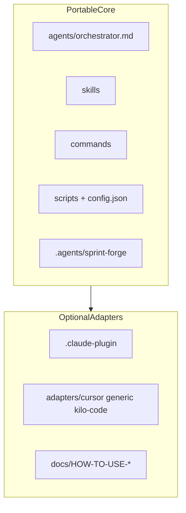

# Architecture

This document describes Kyro's Command > Agent > Skill workflow architecture and the markdown artifacts used to preserve project context.

---

## Portable Core vs Optional Adapters

Kyro separates **portable core** from **harness-specific adapters**:



- **Core** — same on every LLM host; source of truth is markdown + Node scripts.
- **Adapters** — copy-and-customize templates or native plugin packaging; never required for the workflow to function.

See [adapters/README.md](../adapters/README.md) and [agent-adapters.md](agent-adapters.md).

Entry points may be slash commands (Claude Code) or **manual intents** (`forge`, `status`, `wrap-up`) on Cursor, Codex, OpenCode, Kilo Code, and generic API hosts.

---

## Command > Agent > Skill Pattern

Kyro is organized in three layers:

```
User Command (/kyro-workflow:forge, /kyro-workflow:status, /kyro-workflow:wrap-up)
  |
  v
Agent (orchestrator)
  |
  +---> Skill (sprint-forge)
  |
  +---> Skill (qa-review)
```

### Commands

Commands are the user-facing interface. Each command is defined as a markdown file in `commands/` with frontmatter that specifies its description and argument hints.

| Command | Primary Agent | Purpose |
|---------|--------------|---------|
| `/kyro-workflow:forge` | orchestrator | Full cycle: Analyze, Plan, Implement, Review, Close |
| `/kyro-workflow:status` | orchestrator | Read-only project progress and debt summary |
| `/kyro-workflow:wrap-up` | orchestrator | End-of-session closure ritual with quality check and context handoff |

### Agent

The orchestrator coordinates the full sprint lifecycle. It performs read-only analysis during discovery, generates plans, executes approved tasks, runs validation, handles debugging, updates sprint artifacts, and owns lifecycle checkpoints.

| Agent | Toolset | Can Write? | Role |
|-------|---------|-----------|------|
| orchestrator | Read, Glob, Grep, Bash, Edit, Write | Yes | Full lifecycle coordination |

### Skills

Skills provide domain knowledge that the orchestrator consumes.

| Skill | Knowledge Domain |
|-------|-----------------|
| `sprint-forge` | Core orchestration: modes, helpers, templates, gates, re-entry prompts |
| `qa-review` | Senior QA audit, architecture validation, security review, sprint alignment |

---

## Data Flow

```
USER
  |
  v
/kyro-workflow:forge
  |
  v
ORCHESTRATOR
  |-- loads .agents/sprint-forge/rules.md
  |-- reads sprint-forge skill assets
  |-- runs built-in checkpoints
  |
  v
.agents/sprint-forge/{scope}/
  |-- findings/
  |-- sprints/
  |-- ROADMAP.md
  |-- README.md
  |-- RE-ENTRY-PROMPTS.md
```

### Flow for `/kyro-workflow:forge`

1. **Rules Loading** - Orchestrator reads `.agents/sprint-forge/rules.md` if present.
2. **Analysis** - Orchestrator explores the codebase and creates finding files.
3. **Gate 1** - User approves analysis.
4. **Planning** - Orchestrator generates a sprint document with phases and tasks.
5. **Gate 2** - User approves the plan.
6. **Implementation** - Orchestrator executes tasks, runs review checks, and checkpoints after each phase.
7. **Gate 3** - User approves implementation.
8. **Review and Close** - Orchestrator runs retro, updates debt tables in markdown, proposes rules, and updates re-entry prompts.

---

## Artifact Layout

Kyro stores workflow state in markdown files. This keeps the workflow portable across AI coding platforms, easy to review in git, and usable without a local service.

```
.agents/sprint-forge/
├── rules.md
└── {scope}/
    ├── README.md
    ├── ROADMAP.md
    ├── RE-ENTRY-PROMPTS.md
    ├── findings/
    ├── sprints/
    └── handoffs/
```

`{scope}` is the work topic in kebab-case, for example `oauth-implementation` or `ui-redesign`.

The output directory path (`{output_kyro_dir}`) is resolved once at the start of any mode and embedded in `README.md` and `RE-ENTRY-PROMPTS.md`. These two files are the source of truth for the path.

---

## Built-In Checkpoints

The orchestrator runs checkpoints at lifecycle moments:

| Checkpoint | Purpose |
|------------|---------|
| startup | Load rules and detect active sprint state |
| pre-phase | Validate state before a phase starts |
| rule check | Verify relevant learned rules |
| post-edit scan | Detect debug artifacts and likely secrets |
| task complete | Verify task status and checkpoint state |
| pre-commit | Run configured quality gates |
| learn capture | Propose new rules from corrections |

---

## How the Workflow Differs from v1.x

Kyro 3.x is a full workflow that replaces the v1.x single-skill approach.

```
v1.x: User message -> sprint-forge skill -> markdown artifacts

3.x:  User command -> orchestrator
                    -> sprint-forge / qa-review skills
                    -> built-in checkpoints
                    -> markdown artifacts
```

| Dimension | v1.x | 3.x |
|-----------|------|------|
| Type | Single skill | Full workflow with commands, one agent, skills, and checkpoints |
| Entry point | Text triggers | Slash commands |
| Learning | Per-project retro only | Persistent rules in `.agents/sprint-forge/rules.md` |
| Agent | Skill-only execution | Orchestrator |
| Quality gates | Basic | Per-task checklist + approval gates |
| Context transfer | Re-entry prompts | Re-entry prompts + enriched handoffs |
| State model | Markdown artifacts | Markdown artifacts |

---

## Component Map

| Component | Location |
|-----------|----------|
| Commands | `commands/` |
| Orchestrator | `agents/orchestrator.md` |
| Sprint workflow skill | `skills/sprint-forge/` |
| QA review skill | `skills/qa-review/` |
| Deterministic scripts | `scripts/` |
| Harness config | `config.json` → `harness` |
| Harness templates | `adapters/` |
| Claude Code plugin | `.claude-plugin/` (adapter only) |
| Templates | `skills/sprint-forge/assets/templates/` |
| Rules | `.agents/sprint-forge/rules.md` in the target project |
