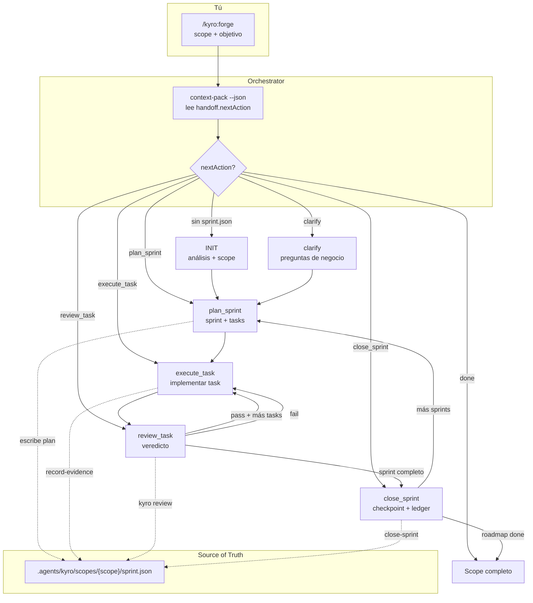
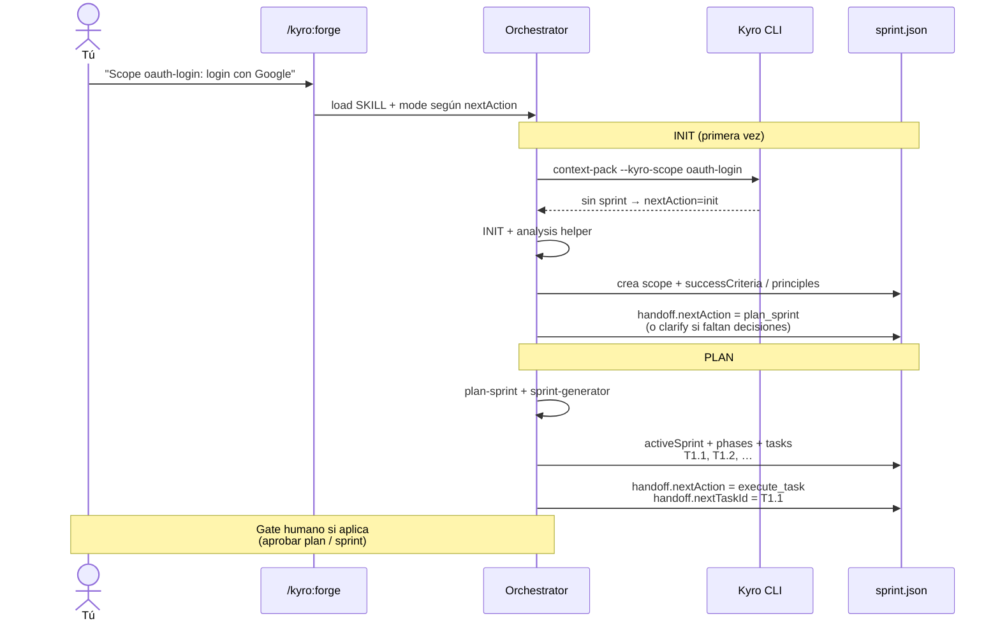
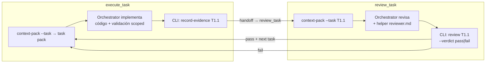
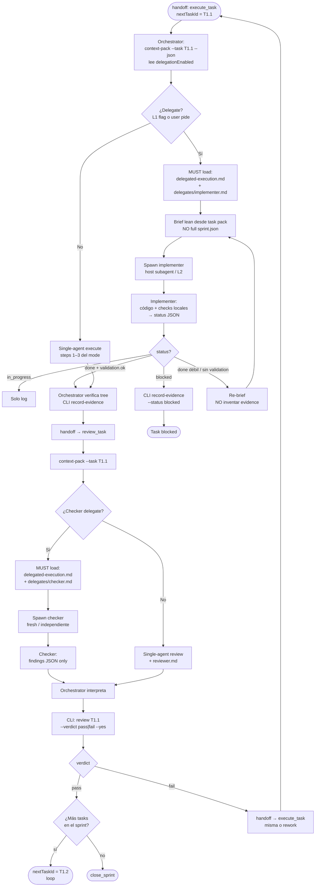
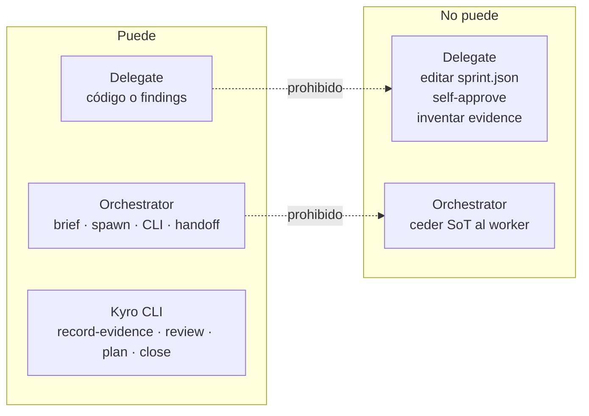
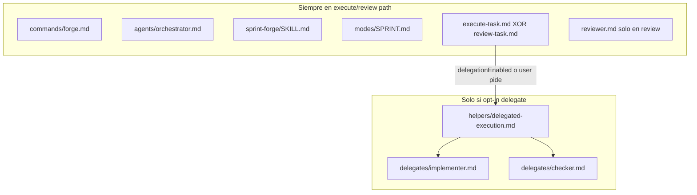

# Overview práctico: scope → sprint → task → execute → review (con delegación)

Flujo real de Kyro. **Un solo agente (orchestrator)** coordina siempre. Los **delegates** son opt-in y solo cubren **una task** a la vez. El **CLI** es el dueño de `sprint.json`.

---

## 1. Mapa de alto nivel (ciclo de vida)



**Regla de oro:** el orchestrator **rutea** con `context-pack`; **no** abre el `sprint.json` completo solo para decidir qué hacer.

---

## 2. De la idea al plan (scope + sprint + tasks)



**Qué queda en el plan de una task típica:**

| Campo | Uso después |
|-------|-------------|
| `id` (ej. `T1.1`) | Unidad de handoff y de delegación |
| `description` / acceptance | Brief del implementer y del checker |
| `files_to_touch` | Scope de cambios y review |
| `depends_on` | Orden de ejecución |

---

## 3. Ejecución + revisión de **una** task (default: single-agent)

Sin `delegationEnabled` y sin “usa delegate”:



```text
Orchestrator = maker + checker (misma sesión)
CLI          = único escritor de evidence + verdict
```

---

## 4. Misma task **con delegación** (L0 / L1)

### Cuándo se enciende

| Capa | Cómo | Efecto |
|------|------|--------|
| **L1** | `local.json` → `execution.delegationEnabled: true` | En cada task de execute/review, el mode **debe** cargar protocol + role |
| **L0** | Tú dices “con delegate implementer / checker” | Solo esa task |
| **Off / sin subagent** | Default o host no puede spawnear | Fallback single-agent (no rompe el forge) |

### Diagrama de una task con delegates



### Matriz de writes (lo que no se puede romper)



---

## 5. Ejemplo narrado (práctica real)

**Scope:** `oauth-login`  
**Sprint 1:** “Google OAuth end-to-end”  
**Tasks:** `T1.1` routes · `T1.2` callback · `T1.3` session  

### Día 0 — plan

```text
/kyro:forge
Scope: oauth-login — login con Google, sin password legacy.
```

1. INIT crea `.agents/kyro/scopes/oauth-login/sprint.json`
2. `plan_sprint` genera Sprint 1 con T1.1–T1.3  
3. `handoff = { nextAction: execute_task, nextTaskId: T1.1 }`

### Día 1 — T1.1 con L1 (delegation on)

```json
// .agents/kyro/local.json (personal, gitignored)
{ "execution": { "delegationEnabled": true } }
```

```text
/kyro:forge
Continue oauth-login. Run the active task.
```

| Paso | Quién | Qué |
|------|-------|-----|
| 1 | Orch | `context-pack --task` → pack + `delegationEnabled: true` |
| 2 | Orch | Load `delegated-execution.md` + `implementer.md` |
| 3 | **Implementer** | Implementa routes; devuelve `{ status: "done", validation: { ok: true } }` |
| 4 | Orch | Verifica; `record-evidence T1.1 …` (**sin** `--yes`) |
| 5 | Orch | handoff → `review_task` |
| 6 | Orch | Load protocol + `checker.md` |
| 7 | **Checker** | Findings JSON (sin tocar SoT) |
| 8 | Orch | `review T1.1 --verdict pass --yes` |
| 9 | CLI | handoff → `execute_task` / `T1.2` |

### Si no hay subagent

El mode dice: **fallback a steps 1–3 / 1–5**. El forge no se para. Misma task, mismo CLI, sin worker.

### Cierre de sprint

Cuando no quedan tasks pendientes:

```text
close-sprint → archive checkpoint + ledger + limpia activeSprint
```

Siguiente sprint del roadmap → otra vez `plan_sprint`, o `done` si el scope terminó.

---

## 6. Vista “quién carga qué” (tokens / progressive disclosure)



Por eso slim modes + fail-safe en el mode: el contrato duro vive en el path eager; el protocolo largo solo se paga cuando delegas.

---

## 7. Resumen en una frase

> **Plan** escribe el sprint y las tasks en `sprint.json` → **Execute** hace una task (tú o un implementer) y solo el CLI graba evidence → **Review** valida (tú o un checker) y solo el CLI graba el verdict → el orchestrator **loop**a tasks y cierra el sprint; **nunca** un delegate es dueño del scope ni del `sprint.json`.

---

## Related docs

- [Architecture — Delegated execution](architecture.md#delegated-execution-protocol-opt-in)
- [Getting started — Delegated execution](getting-started.md#delegated-execution-optional)
- [Maker/Checker](maker-checker.md)
- [Teams — L1 opt-in](teams.md#delegation-opt-in-l1)
- [Context management — task packs](context-management.md)
