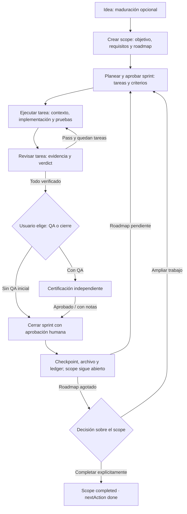

# Kyro — ciclo de vida / happy path (nivel 1)

Este mapa representa el flujo principal, no cada estado o comando. La maduración de idea es opcional; puede comenzarse directamente por definir el scope. Las aprobaciones del usuario siguen siendo gates.

## Cómo leerlo

- **Scope**: el objetivo de trabajo, su especificación y roadmap. Contiene varios sprints.
- **Sprint**: un conjunto acotado de tareas. Cada tarea pasa por ejecución, evidencia y revisión.
- **QA**: certificación independiente opcional en la primera decisión. Si se solicita y falla, hay que corregir y repetir QA antes de cerrar; ese bucle de recuperación no está dibujado en este happy path.
- **Cierre**: preserva evidencia e historial; no implica completar el scope. Un scope completado puede reabrirse; no equivale a retirarlo.
- **Continuidad**: `context-pack` y `nextAction` enrutan al agente. El CLI es dueño de las escrituras de estado.

## Próximos desgloses

1. Idea e inicialización del scope; clarificaciones y aprobación.
2. Planificación del sprint; requisitos, tareas, dependencias y criterios.
3. Microciclo por tarea; evidencia, revisión y correcciones.
4. QA, cierre, archivo y aprendizaje.
5. Cambios del trabajo vigente; remedios, doctor, reopen y discard.

## Evidencia y límites

Proyecto Codebase Memory: `home-rperaza-joisephdev-my-projects-kyro-ecosistem-kyro-ai`.
Generación consultada: `2026-09-17T22:22:48Z`; índice ready, 15397 nodos y 36892 aristas.
Cobertura consultada para las fuentes siguientes: `no_recorded_issue`, `metadata_match` (señal best-effort, no prueba de exhaustividad).

- `src/cli/routing.ts`: rutas init, clarify, plan_sprint, execute_task, review_task, qa_or_close, close_sprint, await_scope_completion y done.
- `src/cli/core/status.ts`: símbolo `deriveLiveWorkHandoff` localizado en el grafo; clasificación de trabajo listo, revisión y finalización.
- `src/cli/checkpoints/sprint-close.ts:208-252`: checkpoint, ledger y transición tras cierre.
- `internal/skills/sprint-forge/assets/modes/qa-or-close.md`: QA inicial opcional, re-QA tras rechazo y aprobación humana para cierre.

## Estado de Archify

HTML entregado: [kyro-lifecycle.html](kyro-lifecycle.html). Especificación: `kyro-lifecycle.workflow.json`. El retorno se representa mediante el nodo de continuación «Siguiente sprint → Volver a planificar».

Validación Archify showcase: 9/9 checks, 0 errores y 0 warnings. Recibo con hashes y tamaños: `kyro-lifecycle.delivery.json`. Prueba automatizada de navegador: PASS (`kyro-lifecycle.visual-check.json`), sin desbordamiento en los tamaños comprobados. Se inspeccionó visualmente la captura de 2048×1320 en tema claro; no implica revisión visual manual de todas las variantes.

El contenido está en español; el visor Archify, cuando se entregue, usa inglés como fallback para su interfaz fija.
